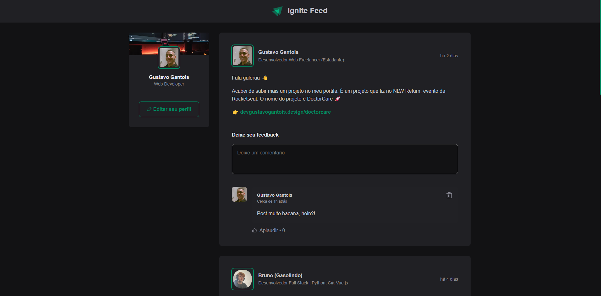
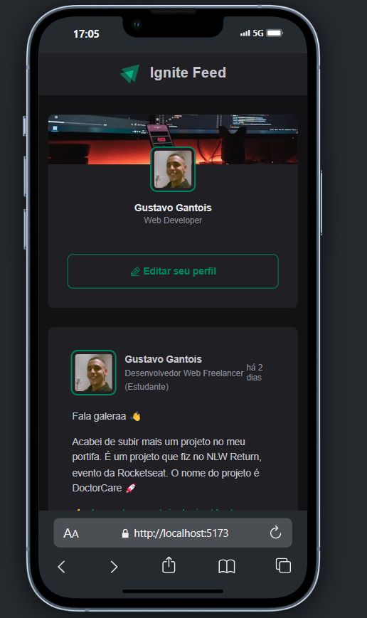

<a href="">Clique aqui para ter acesso a este projeto.</a>

##Ignite Rockeat-Seat

<h1>Rede social Ignite</h1>

Neste projeto, utilizei a tecnologia React com a linguagem TypeScript, complementada por um CSS modularizado. Este desenvolvimento foi crucial para o meu crescimento profissional, permitindo-me aprofundar conhecimentos e habilidades tanto em React quanto em TypeScript. Além disso, a abordagem modular do CSS contribuiu significativamente para a robustez e manutenção do código, consolidando meus conceitos e práticas avançadas no uso dessas tecnologias.

Este projeto também está responsivo para telas menores e dispositivos móveis.

<h1>ING</h1>

<a href="">Click here to access this project.</a>

##Ignite Rockeat-Seat

<h1>Ignite social network</h1>

In this project, we use React technology with the TypeScript language, complemented by modularized CSS. This development was crucial for my professional growth, allowing me to deepen my knowledge and skills in both React and TypeScript. Furthermore, CSS's modular approach contributed significantly to the robustness and maintainability of the code, consolidating my advanced concepts and practices in the use of these technologies.

This project is also responsive for smaller screens and mobile devices.

